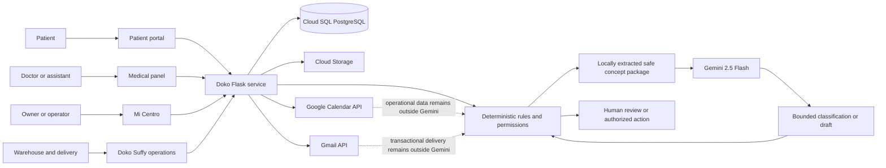

# Doko Architecture

## System boundary

The diagram shows one operating ecosystem, not a collection of independent
products. The portal, medical panel, Mi Centro, and Doko Suffy use the same
application and access boundaries while serving different operational roles.

Google Calendar remains the scheduling foundation. Doko does not attempt to
replace a mature calendar engine. It builds clinic-specific control,
confirmation, audit, and assistance workflows around that integration.

## Application layers

### Web and access layer

- `app_elite.py` creates the Flask application, registers blueprints, applies
  CSRF protection to internal writes, and adds security headers.
- `routes/auth.py` handles doctor OAuth and internal-role authentication.
- `helpers/decorators.py` and `helpers/jwt_auth.py` enforce role, account, and
  active-clinic boundaries.

### Clinic operations

- `routes/panel.py` owns the doctor and assistant panel and its appointment
  operations.
- `agentes/agente_avisos.py` applies the configured notification and
  confirmation cycle.
- `agentes/auditor_calendar.py` reconciles operational state and records
  auditable outcomes.
- `routes/confirmacion.py` handles signed patient confirmation and cancellation
  actions.

### Public presence

- `routes/publico.py` renders the patient portal and its constrained assistant.
- `routes/presencia.py` renders doko.lat, the local physician directory,
  physician pages, local SEO routes, sitemap, privacy policy, and terms.

### Implementation and business operations

- `routes/admin.py` provides Mi Centro and controlled administrative views for
  the integrated operation.
- `routes/implementacion.py` manages versioned clinic implementation,
  protocol-adoption decisions, training, and follow-up records.
- `routes/bodega.py` and `routes/reparto.py` isolate Doko Suffy warehouse and
  delivery responsibilities from clinic-facing roles.

The inventory represented in these routes is Doko Suffy sourcing and logistics
inventory. It is not an attempt to manage every supply drawer inside a clinic.

### Controlled AI layer

- `agentes/gemini_client.py` centralizes model access and aggregate usage
  metadata.
- `agentes/asistente_panel.py` performs local intent extraction and requests a
  bounded classification only when deterministic handling is insufficient.
- `agentes/asistente_evaluacion.py` sanitizes completed implementation notes
  before an optional Gemini review.
- `agentes/nivel4/agente_supervisor.py` keeps severity deterministic and treats
  Gemini output as optional presentation support.

The operating sequence is deliberate:

1. Deterministic permissions and records establish the truth.
2. Gemini may classify, summarize, or suggest within a narrow contract.
3. Deterministic code validates the result.
4. A human authorizes protected or consequential actions.

## Data ownership and isolation

- Each appointment and clinic record is scoped to its physician and clinic.
- Assistant access is revalidated against current physician assignments.
- Warehouse, delivery, administration, doctor, and assistant roles use
  separate routes and permissions.
- OAuth tokens are stored server-side and are never rendered into public pages.
- AI telemetry stores aggregate category, status, token, duration, and cost
  metadata; it does not store patient questions or appointment content.

## Failure behavior

- Gemini failure does not disable deterministic clinic workflows.
- A Google token failure blocks only the operation that requires Google access;
  it does not block profile, service, theme, or public-presence editing.
- Calendar or Gmail failures are audited and surfaced as operational issues.
- Informational clinic signals are separated from platform failures.
- Scheduled jobs require a secret and record their execution outcomes.

The user sees a controlled fallback or a clear operational issue rather than an
AI-generated guess. This keeps the clinic workflow usable when an optional
service is unavailable.
