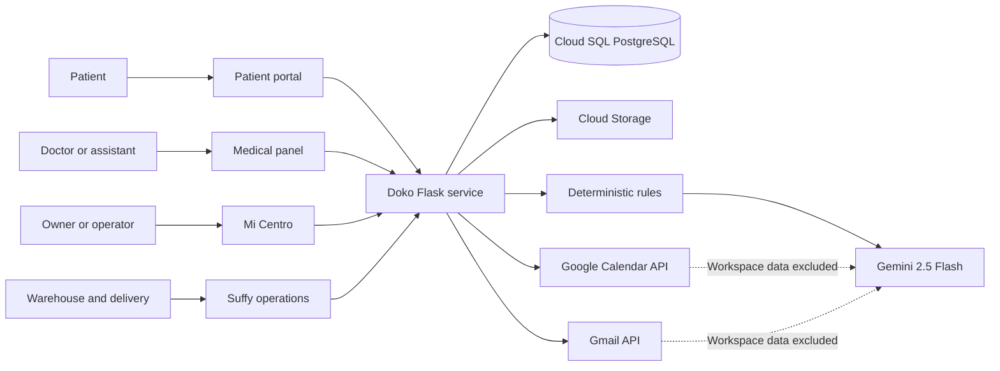

# Doko Architecture

## System boundary

## Application layers

### Web and access layer

- `app_elite.py` creates the Flask application, registers blueprints, applies
  CSRF protection to internal writes, and adds security headers.
- `routes/auth.py` handles doctor OAuth and internal-role authentication.
- `helpers/decorators.py` and `helpers/jwt_auth.py` enforce role and active-clinic
  boundaries.

### Medical operations

- `routes/panel.py` owns the doctor/assistant panel and appointment operations.
- `agentes/agente_avisos.py` applies the configured notification and
  confirmation cycle.
- `agentes/auditor_calendar.py` reconciles operational state and records
  auditable outcomes.
- `routes/confirmacion.py` handles signed patient confirmation and cancellation
  actions.

### Public presence

- `routes/publico.py` renders the patient portal and its constrained assistant.
- `routes/presencia.py` renders doko.lat, the local directory, physician pages,
  local SEO routes, sitemap, privacy, and terms.

### Business operations

- `routes/admin.py` provides Mi Centro, catalog, orders, suppliers, invoices,
  users, supervisor, and AI usage views.
- `routes/bodega.py` and `routes/reparto.py` isolate warehouse and delivery roles.
- `routes/implementacion.py` manages versioned operational implementation and
  training records.

### AI layer

- `agentes/gemini_client.py` centralizes model access and usage metadata.
- `agentes/asistente_panel.py` performs local intent extraction and safe
  operational explanations.
- `agentes/asistente_evaluacion.py` sanitizes implementation notes before an
  optional Gemini review.
- `agentes/nivel4/agente_supervisor.py` keeps severity deterministic and treats
  Gemini summaries as optional presentation.

## Data ownership

- Each appointment and operational record is scoped to its doctor/clinic.
- Assistant access is revalidated against current clinic assignments.
- Warehouse, delivery, administration, doctor, assistant, and admin roles use
  separate routes and permissions.
- OAuth tokens are stored server-side and never rendered into public pages.
- AI telemetry stores aggregate category, status, token, duration, and cost
  data; it does not store patient questions or appointment content.

## Failure behavior

- Gemini failure does not disable deterministic workflows.
- A Google token failure blocks only operations that require Google access; it
  does not block profile, service, theme, or public-presence editing.
- Calendar/Gmail failures are audited and shown as system issues.
- Informational clinic signals are separated from platform errors.
- Scheduled jobs require a secret and record execution outcomes.
